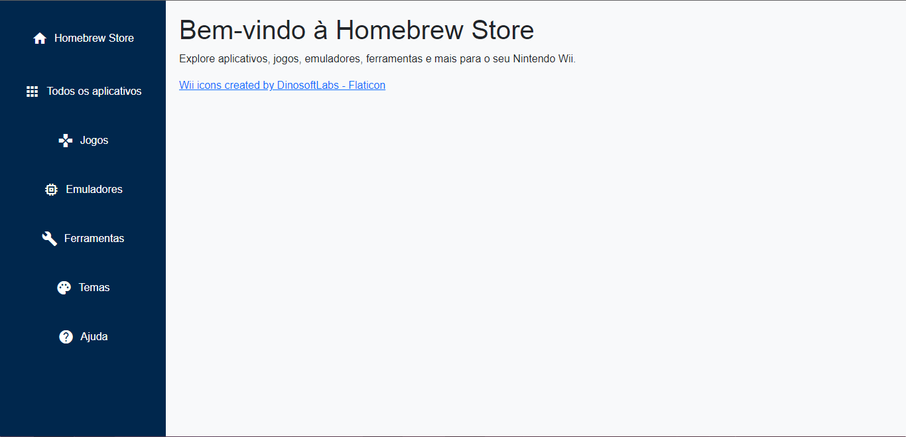

# Wii Homebrew Store

Bem-vindo ao **Wii Homebrew Store**, um site dedicado à organização e distribuição de aplicativos, jogos e ferramentas para o Nintendo Wii. Aqui você encontra tudo que precisa para aproveitar ao máximo o seu console!

## 🔗 Link do Site
[Visite o Wii Homebrew Store](https://wolfdeveloper01.github.io/Wii)

## 🛠 Funcionalidades

- **Apps**: Catálogo completo de aplicativos úteis para o Nintendo Wii, incluindo descrições e links de download.
- **Games**: Biblioteca de jogos homebrew para download e diversão.
- E Muito Mais...

## 🚀 Tecnologias Utilizadas

### Frontend
- **HTML5**: Estrutura básica do site.
- **CSS3**: Estilização e layout.
- **Bootstrap**: Design responsivo e componentes estilizados.
- **JavaScript**: Funções dinâmicas e manipulação de dados.

### Backend
- **Google Apps Script**: API para acessar e organizar dados da planilha.

## 🗂 Organização dos Dados
Os aplicativos e jogos são organizados em uma planilha no Google Sheets, com as seguintes colunas:
- **Nome**: Nome do aplicativo ou jogo.
- **Descrição**: Breve descrição do item.
- **URL da Imagem**: Link para a imagem de exibição.
- **Link de Download**: URL para baixar o aplicativo ou jogo.

Os dados são disponibilizados via uma API criada no Google Apps Script, retornando os dados no formato JSON para integração com o site.

## 🌟 Como Funciona
1. O site consome os dados da planilha através da API do Google Apps Script.
2. Cada seção do site (Apps e Games) utiliza esses dados para exibir as informações dinamicamente.
3. As informações são exibidas em forma de cartões, com imagem, nome, descrição e botão de download.

## 📂 Estrutura do Projeto

```plaintext
.
├── index.html          # Página inicial
├── apps.html           # Página com lista de aplicativos
├── games.html          # Página com lista de jogos
├── favicon.ico         # Ícone do site
├── /assets             # Imagens e outros arquivos estáticos
└── README.md           # Documentação do projeto
```

## 🖼 Capturas de Tela

### Página Inicial


### Lista de Aplicativos


## 📌 Melhorias Futuras
- Adicionar sistema de busca e filtros.
- Implementar suporte a várias línguas.
- Criar uma seção de temas personalizáveis para o Nintendo Wii.

## 👥 Contribuidores
- **Nickolas** - Desenvolvedor e criador do projeto.
<a href="https://github.com/wolfdeveloper01/Wii/graphs/contributors">
  
</a>

## 📝 Licença
Este projeto está sob a licença **MIT**. Consulte o arquivo `LICENSE` para mais informações.

---

Feito com ❤️ para a comunidade de entusiastas do Nintendo Wii.
